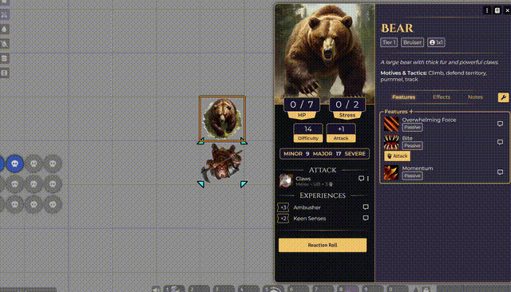

# Ionrift Daggerheart Animator

**Connects Daggerheart to Automated Animations.**

This module is a bridge. It lets Daggerheart attacks (like "Claws", "Bite", or "Melee") trigger animations in [Automated Animations](https://foundryvtt.com/packages/autoanimations), something that doesn't happen by default because Daggerheart attacks aren't standard "Items".

## What it does
It looks at your roll data and "tricks" the animation system into seeing a valid weapon, so your hooks fire correctly. Simple as that.

## Installation
1.  Install **Automated Animations** and **Daggerheart**.
2.  Install this module (`ionrift-daggerheart-animator`).
3.  Enable all three.

## Setup & Usage
1.  Open **Automated Animations** settings.
2.  Go to **Global Automatch**.
3.  Add entries for your common attack names (e.g., "Claws", "Bite", "Slam").
    *   *Tip: Use the "Melee" category for generic swings.*
4.  Roll an attack from a Daggerheart PC or NPC sheet.
5.  Receive animations!

## Support
If you find this module useful, consider supporting the project:
[**Patreon / Buy me a Coffee**](https://patreon.com/ionrift)

More Daggerheart tools are in the works!

## License
MIT
